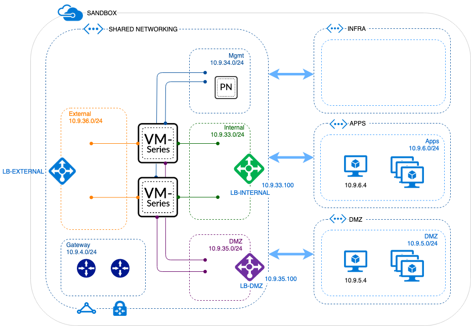

# arm

<a href='https://portal.azure.com/#create/Microsoft.Template/uri/https%3A%2F%2Fraw.githubusercontent.com%2Fphiltaylor%2Farm-templates%2Fmaster%2Ftemplate.json'>Deploy template.json</a>

Ingress LB, 2 NGFW, untrust, trust, DMZ, mgmt, egress LB (2 interfaces) - VNET resides in he same RG as NGFW

<a href='https://portal.azure.com/#create/Microsoft.Template/uri/https%3A%2F%2Fraw.githubusercontent.com%2Fphiltaylor%2Farm-templates%2Fmaster%2Ftemplate-vnet-rg.json'>Deploy template-vnet-rg.json</a>

Ingress LB, 2 NGFW, untrust, trust, DMZ, mgmt, egress LB (2 interfaces) - VNET resides in different RG to NGFW

<a href='https://portal.azure.com/#create/Microsoft.Template/uri/https%3A%2F%2Fraw.githubusercontent.com%2Fphiltaylor%2Farm-templates%2Fmaster%2Ftemplate-vnet-rg.-prod-uks.json'>Deploy template-vnet-rg.-prod-uks.json</a>

Ingress LB, 2 NGFW, untrust, trust, DMZ, mgmt, egress LB (2 interfaces) - VNET resides in different RG to NGFW

